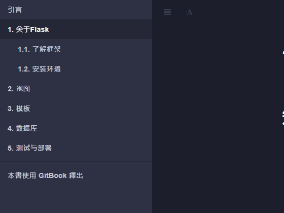

#  Python - Flask Framwork E-book Online Traning

    

## About This Project Details

About This project and the reference link in this repo are for anyone who is interested in learning flask framework or working toward developer world to produce high quality, working style! Check out follow reference link if you think it is interested.

**Project Link:** [Python-Flask Framework E-Book Online Training](http://bdfdportfolio.tk/Demo-02_Flask-Ebook/)

## Project Details

The Project Page enlisted as follows:

- [x] **引言**
- [x] **P1-关于 Flask**
  - [x] **P1.1-了解框架**
  - [x] **P1.2-安装环境**
- [x] **P2-视图**
  - [x] **P2.1-从 Hello World 开始**
  - [x] **P2.2-扩展**
- [x] **P3-模板**
  - [x] **P3.1-变量**
  - [x] **P3.2-过滤器**
  - [x] **P3.3-Web 表单**
  - [x] **P3.4-控制语句**
  - [x] **P3.5-宏、继承、包含**
  - [x] **P3.6-Flask 的特殊变量和方法**
- [x] **P4-数据库**
  - [x] **P4.1-数据库的设置**
  - [x] **P4.2-数据库的基本操作**
  - [x] **P4.3-自定义模型类**
  - [x] **P4.4-数据库迁移**
  - [x] **P4.5-邮件扩展**
- [x] **P5-测试与部署**
  - [x] **P5.1-蓝图**
  - [x] **P5.2-单元测试**
  - [x] **P5.3-部署**
  - [x] **P5.4-RESTful**
  - [x] **P5.5-性能**

## Project Description:

 
<!-- Description: Here you can add more detail information about this project and describe it in the documentation for more details. -->

## Tools Used In This Project

**Tools:** GitHub, Visual Studio Code Editor

**Libraries:** HTML, CSS, and JavaScript

**Projects:** Python-Flask Framework E-Book Online Training

**Reference:**  
Demo: <a href="http://bdfdportfolio.tk/Demo-02_Flask-Ebook/">Demo Website Link</a>  
Reference:

- <a href="https://github.com/BDFDPortfolio/Demo-02_Flask-Ebook">Orginal Data Source Link</a>

   

### Thanks For Watch This Repositories!

### <i>KEEP AWESOME & STAY COOL!</i>

### Feel Free To Fork And Report If You Find Any Issue :)

